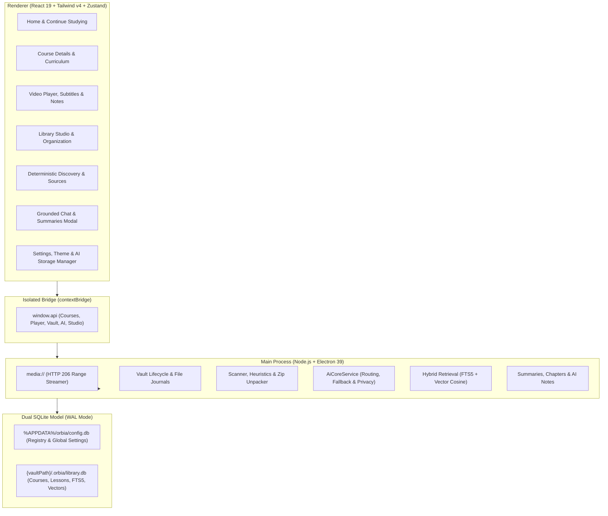

# 🪐 Orbia — Personal Course & Study Platform

> **Your personal, open-source study universe.**  
> Transform disorganized folders of video lessons, PDFs, and course materials into a polished, distraction-free desktop study platform.

[](LICENSE)
[](<>)
[](<>)
[](<>)

---

## 🌟 The Vision

Most self-learners accumulate gigabytes of course materials: video lessons, lecture slides, exercises, PDFs, and archives scattered across folders with messy names like `001.mp4`, `aula1.mp4`, or `Modulo 02/03_sub.mp4`.

**Orbia** bridges the gap between raw local files and modern learning platforms (like Gran Cursos, Coursera, or Udemy). It gives you a unified, offline-first desktop app that automatically understands your course structure, tracks your exact study progress, and keeps you focused on learning with zero telemetry and 100% local privacy.

---

## ✨ Core Pillars & Features (v1.0.0)

### 🏛️ 1. Hybrid Study Vault Architecture

- **Portable & Self-Contained**: The entire library database (`.orbia/library.db`) lives inside your vault folder. Copy or back up the vault folder, and you preserve your entire library, watch history, and notes.
- **Dual SQLite Topology**: Global preferences and vault registry live in `%APPDATA%/orbia/config.db`, while course contents and study metadata live in the vault database with WAL mode and foreign key integrity.
- **Hybrid Flexibility**: Store courses directly inside the vault (`Courses/`) or link to existing directories anywhere on your disk by reference without duplicating files.

### 🎬 2. Cinematic Video Player & Learning Engine

- **HTTP 206 Streaming Protocol**: Custom `media://` streaming engine with instant scrubbing and seeking across 4K, 1080p, MP4, MKV, and WebM files.
- **Exact Progress Memory**: Automatically saves playback position down to the second (throttled every 3s + on pause/seek/unload).
- **Subtitles & Attached Resources**: Auto-detects and converts `.srt` sidecars into WebVTT on the fly; native viewer for PDF slides and handouts.
- **Timestamped Notes & Bookmarks**: Create notes tied to video moments with markdown export; press `B` anytime to save an instant bookmark.

### 🎨 3. Visual Library Studio & Organization

- **Smart Structure Detection**: Automatically parses directory nesting into Course ➔ Modules ➔ Lessons ➔ Sidecar Resources.
- **Natural Sorting & Title Cleaner**: `Lesson 2` reliably precedes `Lesson 10`; strips release noise, hashes, numbering tags, and underscores into readable titles.
- **Custom Metadata & Sections**: Create custom fields, themes, collections, sections, and multipart lesson merging with non-destructive preview.
- **Storage Optimizer**: Identifies duplicate files and creates secure canonical links to reclaim disk space.

### 🧭 4. Deterministic Discovery & Study Routine

- **Smart Recommendations**: Suggests next courses based on recency, study streaks, and completion rates without needing AI or cloud servers.
- **Study Analytics & Goals**: Daily study goals, streaks, and chronological watch history logs.

### 🤖 5. Optional Offline-First AI Subsystem (Zero Mandatory Cloud)

- **Local Whisper & Cloud Transcription**: Transcribe video audio locally using Whisper.cpp or via cloud providers.
- **Semantic Indexing & Hybrid Search**: SQLite FTS5 lexical matching combined with vector cosine similarity for sub-50ms query responses.
- **Grounded Chat with Strict Navigation Validation**: AI answers grounded exclusively in verified course transcripts with validated timestamp links.
- **Structured Summaries & Automatic Chapters**: On-demand summaries for Lessons, Modules, and Courses; monotonic video chapters with full preservation of user manual edits.
- **AI Storage Manager & Local Usage Tracking**: Granular visibility to clear AI caches independently without touching original media; 100% on-device usage metrics.

### ⌨️ 6. Keyboard-First & Impeccable Craft UI

- **Accessible Navigation**: Press `?` or `F1` anywhere to view the interactive **Keyboard Shortcuts Cheatsheet**.
- **Resilient Multi-Layered Error Boundaries**: Zero whitescreens — recover failed panels or return home with 1 click.
- **Tactile Dark & Light Themes**: Powered by Tailwind CSS v4, Radix UI primitives, and Lucide icons.

---

## ⌨️ Keyboard Shortcuts Reference

| Shortcut               | Action                                                             | Scope  |
| ---------------------- | ------------------------------------------------------------------ | ------ |
| `?` or `F1`            | Open Keyboard Shortcuts Cheatsheet                                 | Global |
| `Ctrl + K` / `Cmd + K` | Open Global Library Search                                         | Global |
| `Ctrl + I` / `Cmd + I` | Open Course Import Wizard                                          | Global |
| `Ctrl + ,` / `Cmd + ,` | Open Settings                                                      | Global |
| `Alt + 1 .. 6`         | Switch Tabs (Library, Discover, Studio, Review, History, Settings) | Global |
| `Esc`                  | Close Active Modal / Search Dialog                                 | Global |
| `Space` / `K`          | Play / Pause Video                                                 | Player |
| `←` / `→`              | Seek ±5 Seconds                                                    | Player |
| `J` / `L`              | Seek ±10 Seconds                                                   | Player |
| `↑` / `↓`              | Volume Up / Down (±10%)                                            | Player |
| `M`                    | Toggle Mute                                                        | Player |
| `F`                    | Toggle Fullscreen                                                  | Player |
| `C`                    | Toggle Subtitles (CC)                                              | Player |
| `P`                    | Toggle Picture-in-Picture                                          | Player |
| `>` / `<`              | Increase / Decrease Playback Speed                                 | Player |
| `N`                    | Jump to Next Lesson                                                | Player |
| `B`                    | Bookmark Current Timestamp                                         | Player |
| `Shift + N`            | Create / Focus Timestamped Note                                    | Player |

---

## 🏗️ Architecture



---

## 🚀 Getting Started (Development)

### Prerequisites

- [Node.js](https://nodejs.org/) (v20+ or v22+ recommended)
- [npm](https://www.npmjs.com/)
- C/C++ build tools (for `better-sqlite3` native compilation on your OS)

### Installation & Setup

```bash
# Clone the repository
git clone https://github.com/orbia-app/orbia.git
cd orbia

# Install dependencies
npm install

# Run the full automated test suite (563+ tests)
npm test

# Start development environment (Electron + Vite HMR)
npm run dev
```

### Production Build & Packaging

```bash
# Type check and build bundles
npm run build

# Package standalone installer for your OS
npm run build:win    # Windows installer (.exe NSIS)
npm run build:mac    # macOS disk image (.dmg)
npm run build:linux  # Linux package (AppImage / deb)
```

---

## 🛡️ Privacy & Security Commitments

1. **User Data Sovereignty**: All courses, progress logs, transcripts, notes, and study history reside 100% locally on your machine.
2. **Zero Telemetry**: No tracking pixels, no telemetry pings, and no analytics collection.
3. **Never Silent File Mutations**: Orbia will never move, rename, or delete files on your storage without an explicit preview and confirmation dialog.
4. **Isolated AI Boundaries**: Privacy mode `LOCAL_ONLY` strictly blocks any outbound network requests to cloud AI providers.

---

## 📄 License

This project is licensed under the [MIT License](LICENSE).
